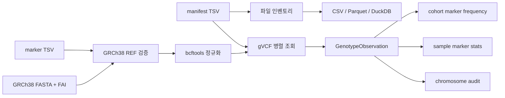

# genomeproject 기술 문서

## 1. 목적과 범위

`genomeproject`는 다음 두 작업을 수행하는 Python CLI입니다.

1. WGS 산출물 manifest를 검사하고 파일·인덱스·샘플 완전성 인벤토리를 생성합니다.
2. 단일 샘플 gVCF에서 지정된 GRCh38 마커를 조회하고 raw/QC 대립유전자 빈도와 샘플별 상세 통계를 생성합니다.

원본 CRAM, gVCF, VCF 등의 내용은 수정하지 않습니다. 출력은 별도 `results/` 경로에 CSV, Parquet, DuckDB 형식으로 기록합니다. 외부 원본 인덱스를 재생성하는 작업은 CLI의 책임 범위에 포함되지 않습니다.

## 2. 기술 스택

- Python 3.11
- pysam: FASTA, gVCF 및 tabix 인덱스 접근
- bcftools: 입력 마커 정규화
- DuckDB: CSV→Parquet 변환, inventory catalog, 결과 조회
- PyYAML: 실행 설정 로드
- pytest: 단위·회귀 테스트
- `ProcessPoolExecutor`: 여러 gVCF의 병렬 조회

의존성 버전과 설치 채널은 [`environment.yml`](environment.yml), Python 패키지 정의는 [`pyproject.toml`](pyproject.toml)을 기준으로 합니다.

## 3. 코드 구조

```text
src/genomeproject/
├── cli.py
├── config.py
├── inventory/
│   ├── builder.py
│   ├── models.py
│   └── validator.py
├── markers/
│   ├── frequency.py
│   ├── gvcf_reader.py
│   ├── models.py
│   └── normalizer.py
└── storage/
    └── exporters.py
```

주요 책임:

- `cli.py`: 명령 파싱, 전체 실행 흐름, 병렬 작업, 결과 경로 관리
- `config.py`: YAML을 불변 `AppConfig`로 변환하고 기본값 적용
- `inventory.builder`: manifest 파싱, 경로 정규화, 파일·인덱스 검사
- `inventory.validator`: 유형별 요약과 샘플별 완전성 계산
- `markers.normalizer`: 마커 TSV 검증, FASTA REF 확인, bcftools 정규화
- `markers.gvcf_reader`: 마커 위치의 gVCF record 해석과 샘플별 observation 생성
- `markers.frequency`: cohort 빈도 집계와 샘플×마커 상세 통계 생성
- `storage.exporters`: CSV, Parquet, DuckDB 출력

## 4. 데이터 흐름



마커 빈도 작업은 manifest에서 `data_type=gvcf`인 행만 사용합니다. CRAM의 누락이나 인덱스 문제는 inventory에는 기록되지만 gVCF 빈도 계산을 직접 차단하지 않습니다.

## 5. 설정 모델

설정은 YAML 네 개 section으로 구성됩니다.

| Section | 필드 | 의미 |
|---|---|---|
| `reference` | `build` | 기준 genome build 이름 |
| `reference` | `fasta` | 기준 FASTA 경로 |
| `inventory` | `expected_data_types` | 완전성 검사 대상 데이터 유형 |
| `markers` | `min_gq` | QC 최소 genotype quality |
| `markers` | `min_dp` | QC 최소 read depth |
| `markers` | `autosomes_only` | 상염색체 1–22만 허용할지 여부 |
| `markers` | `normalize` | bcftools 정규화 수행 여부 |
| `markers` | `workers` | gVCF 병렬 worker 수, 최소 1 |
| `output` | `root` | 기본 결과 루트 경로 |

`reference.build`와 `reference.fasta`는 필수입니다. 나머지는 [`src/genomeproject/config.py`](src/genomeproject/config.py)의 기본값을 사용합니다.

## 6. 입력 계약

### 6.1 파일 manifest

필수 열:

| 필드 | 형식 | 규칙 |
|---|---|---|
| `sample_id` | 문자열 | 공란 불가 |
| `data_type` | enum | `cnv`, `cram`, `dtc`, `gvcf`, `sv`, `vcf` |
| `path` | 문자열 | 공란 불가, 절대경로 권장 |

같은 `sample_id + data_type` 조합이 여러 행이면 `DUPLICATE_SAMPLE_TYPE`, 같은 경로가 여러 행이면 `DUPLICATE_PATH`로 기록합니다.

### 6.2 마커 TSV

필수 열:

| 필드 | 형식 | 규칙 |
|---|---|---|
| `marker_id` | 문자열 | 파일 내 고유값 |
| `chrom` | 문자열 | 기본 설정에서는 상염색체 1–22 |
| `pos` | 1-based 정수 | 1 이상 |
| `ref` | 문자열 | GRCh38 FASTA와 일치해야 함 |
| `alt` | 문자열 | 한 행에 ALT 하나, 쉼표 구분 multi-ALT 금지 |

rsID는 allele 자체가 아니라 locus 식별자일 수 있으므로 분석 전 `chrom:pos:ref:alt`를 명시적으로 확정해야 합니다.

### 6.3 gVCF

- tabix `.tbi` 또는 CSI `.csi` 인덱스가 필요합니다.
- 파일 header에는 정확히 한 개 sample이 있어야 합니다.
- contig는 마커의 `3`/`chr3` 표기를 header에 맞게 해석합니다.
- `GT`, `GQ`, `DP`를 읽으며 `AD`가 있으면 상세 결과에 보존합니다.
- AD가 없을 때 DP로 allele depth를 추정하지 않습니다.

## 7. 인벤토리 판정 규칙

파일별 `status`는 복수 문제를 세미콜론으로 연결합니다.

| 상태 | 의미 |
|---|---|
| `OK` | 감지된 문제 없음 |
| `MISSING` | 경로가 존재하지 않음 |
| `NOT_FILE` | 경로는 존재하지만 일반 파일이 아님 |
| `UNINDEXED` | 파일 유형에 필요한 인덱스를 찾지 못함 |
| `DUPLICATE_PATH` | 동일 경로가 manifest에 중복됨 |
| `DUPLICATE_SAMPLE_TYPE` | 동일 sample/type 조합이 중복됨 |
| `STAT_ERROR` | 파일 크기 조회 중 OS 오류 발생 |

인덱스 후보:

- CRAM: `sample.cram.crai`, `sample.crai`
- bgzip VCF/gVCF/SV: `file.vcf.gz.tbi`, `file.vcf.gz.csi`
- BCF: `file.bcf.csi`

`expected_sample_count`는 manifest 전체의 고유 sample ID 수입니다. 따라서 특정 데이터 유형만 가진 샘플도 전체 기대 샘플 수에 포함됩니다.

## 8. 마커 검증과 정규화

검증 순서:

1. TSV 필수 열·값·중복 검사
2. 상염색체 제한 검사
3. FASTA에서 contig 해석
4. FASTA의 해당 위치 sequence와 `ref` 비교
5. 실제 FASTA contig와 길이를 포함한 임시 VCF 생성
6. `bcftools norm -f FASTA -m -any` 실행
7. 정규화된 마커의 REF를 FASTA에서 재검증

FASTA contig가 `chr3`이고 입력이 `3`인 경우처럼 접두사만 다른 표기는 자동 해석합니다. 두 후보가 모두 존재하거나 어느 것도 존재하지 않으면 모호성 오류를 반환합니다.

## 9. gVCF 판독 알고리즘

각 sample×marker에 대해 마커 위치와 겹치는 record를 조회합니다.

판정 우선순위:

1. 정확한 `POS + REF + 대상 ALT` record가 하나면 `TARGET_VARIANT`
2. 정확한 target record가 여러 개면 `AMBIGUOUS_RECORDS`
3. 같은 POS의 REF가 마커 REF와 다르면 `REF_MISMATCH`
4. 마커를 덮는 유일한 `<NON_REF>` 또는 `<*>` reference block이면 `REFERENCE_BLOCK`
5. 같은 위치에 다른 ALT가 있고 target ALT가 없으면 `OTHER_ALT`
6. record가 없으면 `NO_RECORD`
7. record는 있지만 안전하게 하나로 판정할 수 없으면 `UNSUPPORTED_OR_AMBIGUOUS`

파일·header·조회 단계 오류:

| 상태 | 의미 |
|---|---|
| `OPEN_ERROR` | gVCF를 열 수 없음 |
| `SAMPLE_COUNT_ERROR` | header sample 수가 1이 아님 |
| `QUERY_ERROR` | contig 해석 또는 indexed fetch 실패 |
| `NON_REF_GENOTYPE` | GT가 symbolic non-reference allele을 직접 참조 |

reference block의 `REF`는 block 시작 위치의 염기입니다. 마커가 block 중간에 있으면 그 `REF`를 마커 위치 REF와 직접 비교하지 않습니다. 이 구분은 reference genotype의 call rate를 보존하는 데 필수적입니다.

## 10. 호출 및 QC 규칙

`raw_called`는 GT의 모든 allele이 실제 정수로 호출된 경우 참입니다. QC 제외는 다음 우선순위를 사용합니다.

1. 불완전 GT → `NO_CALL`
2. GQ 없음 → `MISSING_GQ`
3. GQ < `min_gq` → `LOW_GQ`
4. DP 없음 → `MISSING_DP`
5. DP < `min_dp` → `LOW_DP`
6. 위 조건 없음 → `qc_called=true`

한 record가 여러 조건을 동시에 만족해도 가장 먼저 판정된 사유 하나만 `qc_exclusion`에 기록됩니다.

## 11. 통계 정의

### 11.1 Cohort 통계

| 필드 | 정의 |
|---|---|
| `called_n` | 해당 raw/QC 기준을 통과한 sample 수 |
| `call_rate` | `called_n / cohort_n` |
| `AC` | 대상 ALT allele의 합계 |
| `AN` | 실제 호출된 allele 수의 합계 |
| `AF` | `AC / AN` |
| `carrier_n` | 대상 ALT dosage가 1 이상인 sample 수 |
| `hom_ref_n` | 이배체이며 target dosage 0인 sample 수 |
| `het_n` | 이배체이며 target dosage 1인 sample 수 |
| `hom_alt_n` | 이배체이며 target dosage 2인 sample 수 |

AN은 항상 `2 × cohort_n`이 아닙니다. no-call, haploid call 또는 QC 제외가 있으면 실제 포함된 allele 수만 합산합니다.

### 11.2 샘플×마커 통계

`sample_marker_stats.csv/.parquet`의 주요 필드:

| 필드 | 정의 |
|---|---|
| `gt` | gVCF genotype, phasing 구분자 보존 |
| `ac` | 해당 sample의 대상 ALT dosage |
| `an` | 해당 sample에서 호출된 allele 수 |
| `af` | sample 단위 `ac / an` |
| `dp` | FORMAT/DP |
| `gq` | FORMAT/GQ |
| `ad` | FORMAT/AD 원본 순서를 쉼표로 연결한 값 |
| `ref_ad` | AD의 REF depth, 즉 첫 번째 값 |
| `target_ad` | 대상 ALT가 record에 있을 때 해당 allele의 AD |

reference block이나 `OTHER_ALT` record에는 대상 ALT가 record allele로 존재하지 않으므로 `target_ad`를 0으로 추정하지 않고 null로 둡니다. no-call은 `an=0`, `af=null`입니다.

## 12. 출력 계약

### 12.1 Inventory

```text
results/<run-id>/
├── run_config.yaml
└── inventory/
    ├── file_inventory.csv
    ├── file_inventory.parquet
    ├── inventory_summary.csv
    ├── inventory_summary.parquet
    ├── sample_completeness.csv
    ├── sample_completeness.parquet
    └── inventory.duckdb
```

### 12.2 Marker frequency

```text
results/<run-id>/
├── run_config.yaml
└── marker_frequency/
    ├── marker_frequency.csv
    ├── marker_frequency.parquet
    ├── sample_marker_stats.csv
    ├── sample_marker_stats.parquet
    └── audit_by_chrom/
        └── chrom=<contig>/
            ├── observations.csv
            └── observations.parquet
```

`sample_marker_stats`는 sample ID 우선으로 정렬합니다. `audit_by_chrom`은 provenance 보존용 원시 observation이며 `source_gvcf`를 포함합니다.

## 13. 재현성과 provenance

각 실행은 결과 상위 경로에 `run_config.yaml`을 기록합니다.

- 기준 build 및 해석된 FASTA 절대경로
- inventory 기대 데이터 유형
- GQ/DP threshold
- 상염색체 제한과 정규화 여부
- worker 수
- 입력 manifest 및 marker 파일 절대경로

민감한 운영 경로가 포함될 수 있으므로 `run_config.yaml`과 결과 디렉터리는 기본적으로 Git에서 제외합니다. 외부 공유 전에는 경로, sample ID 및 source gVCF 컬럼을 비식별화해야 합니다.

## 14. 성능 특성

- 작업 단위는 gVCF 한 파일이며 process pool로 병렬화합니다.
- 각 worker는 모든 target marker를 한 sample gVCF에서 indexed fetch합니다.
- 메모리에는 전체 `sample 수 × marker 수` observation이 유지됩니다.
- 출력 행 수는 일반적으로 `sample 수 × marker 수`입니다.
- worker 수를 늘리면 storage random I/O가 병목이 될 수 있으므로 디스크 특성에 맞게 조절해야 합니다.

## 15. 알려진 제한과 운영 주의사항

- 기본 구현은 상염색체 이배체 분석을 중심으로 설계됐습니다.
- 한 gVCF에 정확히 한 sample만 지원합니다.
- cohort joint VCF를 직접 입력하는 기능은 없습니다.
- AD가 없는 gVCF에서 allele depth를 추정하지 않습니다.
- 오래된 `.tbi` 경고는 timestamp 경고일 수도 있지만 실제 stale index일 수도 있습니다. audit의 `QUERY_ERROR` 확인만으로 index 내용의 동일성을 완전히 보장할 수는 없습니다.
- `samtools quickcheck`의 `missing EOF block`은 CRAM 손상 가능성을 나타냅니다. 검증 전 인덱스 재생성을 정상화 수단으로 사용하지 않습니다.
- rsID만으로 ALT를 자동 선택하지 않습니다.
- `--skip-normalization`은 이미 정규화가 보장된 입력 또는 제한된 개발 테스트용입니다.

## 16. 테스트 전략

테스트는 다음을 검증합니다.

- manifest 필수 열과 허용 데이터 유형
- 파일·인덱스 누락, 중복 및 sample 완전성
- gVCF target variant, 다른 ALT, reference block, no-record 판독
- block 시작 REF와 마커 위치 REF가 다를 때의 spanning reference block
- GQ 기반 QC 제외와 raw/QC AC·AN·AF 계산
- 샘플별 GT, AC, AN, AF, DP, GQ, AD 추출
- FASTA REF 검증과 contig header를 포함한 bcftools 정규화
- CSV→Parquet 변환 및 행 보존

```bash
pytest -q
```

대용량 실제 데이터에 대한 검증은 단위 테스트와 별도로 수행해야 합니다. 최소한 결과 행 수, call rate, status 분포, QC 제외 분포, genotype 합계와 AC 산술 일치를 확인합니다.

## 17. 보안 원칙

- 실제 기관명, 프로젝트명, sample ID, 서버 경로를 추적 문서에 기록하지 않습니다.
- 실제 manifest, marker 목록, local config 및 결과는 Git에 커밋하지 않습니다.
- 외부 공유 테이블에서는 `sample_id`와 `source_gvcf`를 제거하거나 비식별화합니다.
- 원본 데이터 영역의 인덱스를 덮어쓰는 작업은 별도 운영 승인 후 수행합니다.
- 로그와 issue에도 실제 경로가 포함되지 않도록 오류 메시지를 검토합니다.
